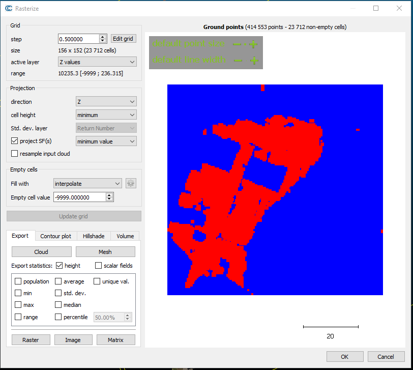
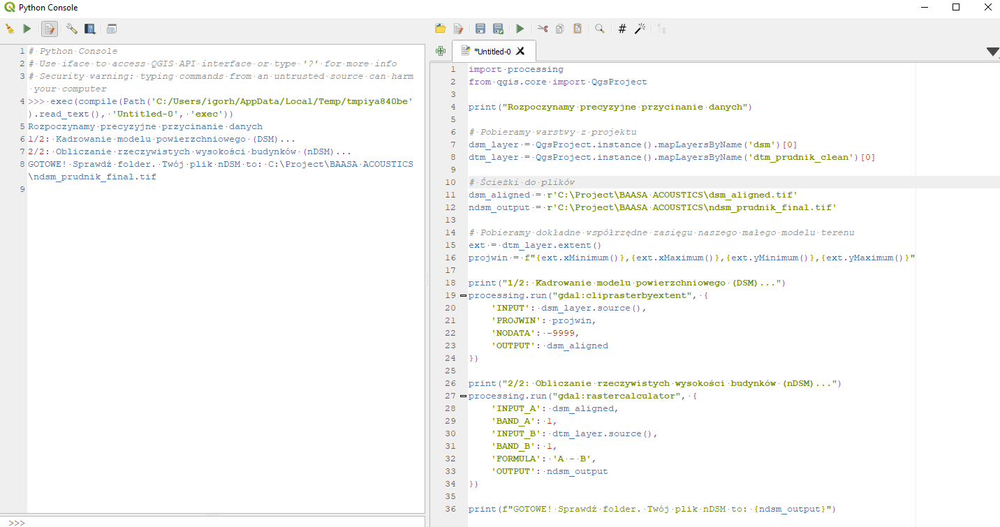
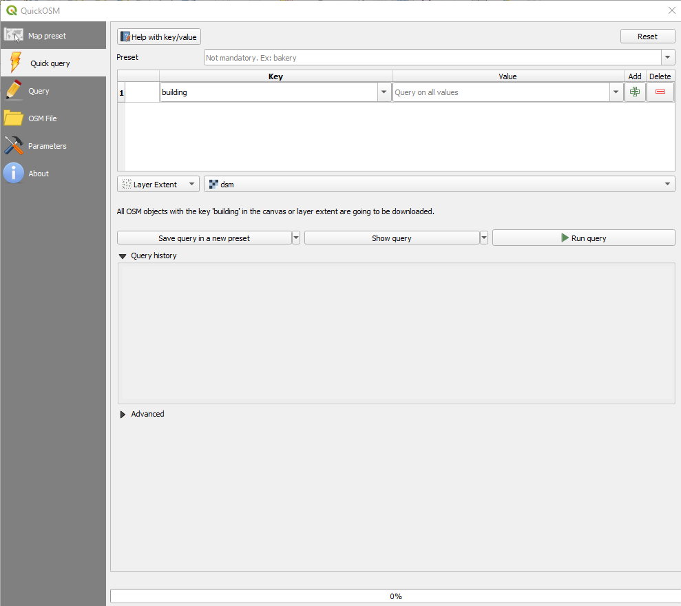
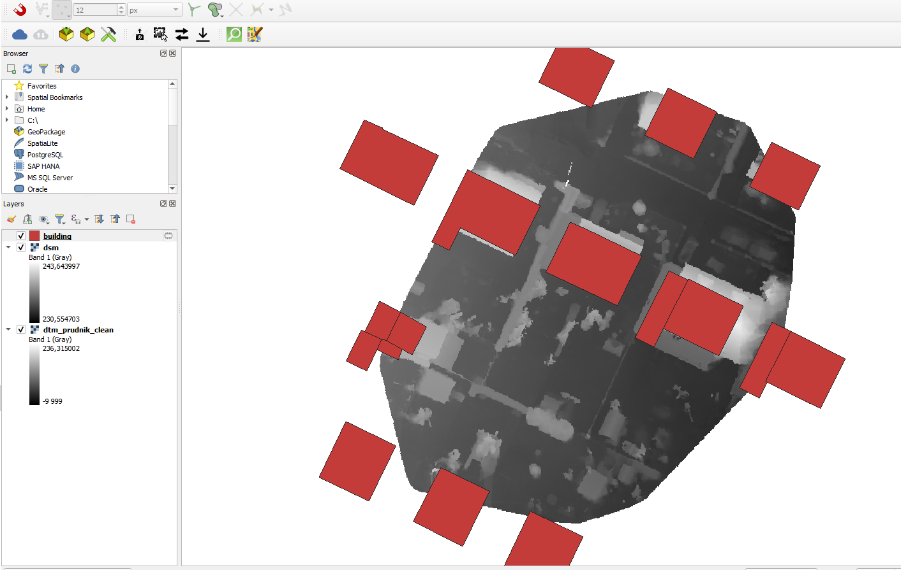
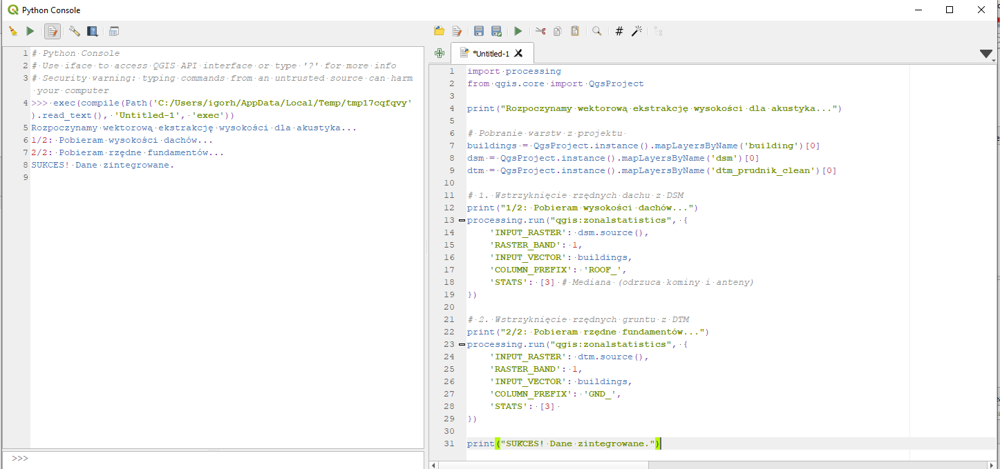
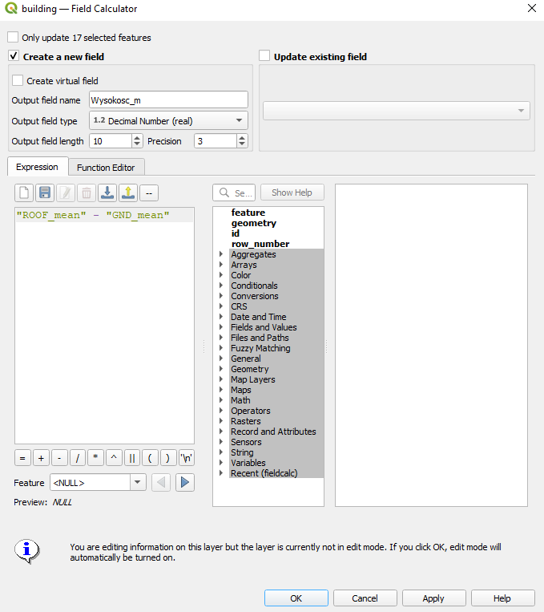

# Automated LoD1 Building Generation for Acoustic Analysis (PyQGIS)

## Overview
This repository contains a Proof of Concept (PoC) PyQGIS script developed to automate the extraction of building heights from UAV-derived elevation models (DTM/DSM) to generate Level of Detail 1 (LoD1) 3D buildings. 

The primary business goal is to prepare clean, reproducible spatial data ready for acoustic simulation software (e.g., CadnaA, SoundPLAN). As a GIS Analyst, my focus here is on transitioning raw UAV data into analysis-ready topology using automated workflows.

## Tech Stack
*   **Point Cloud Processing:** CloudCompare (CSF Algorithm)
*   **GIS Environment:** QGIS 3.x
*   **Automation:** Python / PyQGIS API
*   **Output Format:** GeoPackage (EPSG: 2180)

---

## Step-by-Step Workflow

### 1. Point Cloud Processing & Rasterization
Before automating in QGIS, the raw UAV point cloud was filtered using the Cloth Simulation Filter (CSF) to separate ground from non-ground points. The results were rasterized into a Digital Terrain Model (DTM) and Digital Surface Model (DSM).

### 2. Automated Raster Processing (PyQGIS)
To ensure perfect alignment and calculate the normalized Digital Surface Model (nDSM), a Python script was executed within the QGIS console. This script automatically clips the DSM to the exact extent of the DTM and performs raster math (`DSM - DTM = nDSM`).

### 3. Vector Data Integration
Building footprints were acquired automatically using the QuickOSM plugin, querying standard OpenStreetMap building tags within the specific extent of the project area.

### 4. Zonal Statistics Automation (PyQGIS)
Instead of manual extraction, a custom PyQGIS script was deployed to run zonal statistics. The script iteratively calculates the median elevation values for both the roof (from DSM) and the ground (from DTM) for every single building polygon, rejecting anomalies like chimneys or antennas.

### 5. Data Cleaning and Height Calculation
To prepare the final 3D extrusion, the relative height of each building was calculated. To prevent software crashes in acoustic engines due to `NULL` values (missing data), defensive SQL functions like `coalesce` were implemented during the calculation phase.

---

## Results & Impact
*   **Automated Generation:** Multiple LoD1 buildings generated automatically over the test area without manual point-clicking.
*   **Software Compatibility:** Output saved as a structured GeoPackage, resolving common geometry bottlenecks when importing data into CadnaA.
*   **Scalability:** The PyQGIS script establishes a fully reproducible workflow for future acoustic modeling datasets, drastically reducing manual editing time.
