# Automated LoD1 Building Generation for Acoustic Analysis

## GIS Automation & Software QA Case Study

This repository combines a practical **PyQGIS / UAV GIS workflow** with a structured **software testing case study**.

The project originally started as a Proof of Concept (PoC) for automating the extraction of building heights from UAV-derived elevation models (DTM/DSM) to generate Level of Detail 1 (LoD1) building data.

The same application was later used as a real software test object to demonstrate:

- requirements analysis,
- test planning,
- test case design,
- positive and negative testing,
- defect reporting in Jira,
- defect lifecycle and retesting,
- SQL / database validation,
- independent verification of spatial calculations,
- controlled test data preparation,
- versioned corrective builds.

The primary business goal of the original application is to prepare clean and reproducible spatial data for acoustic simulation software such as **CadnaA** and **SoundPLAN**.

---

## QA Case Study

### Objective

The QA process verifies whether the PyQGIS application correctly:

- loads the required spatial layers,
- calculates median roof elevation from DSM,
- calculates median ground elevation from DTM,
- preserves building records and geometries,
- exports processed data to GeoPackage,
- handles invalid or missing input,
- produces logically consistent results,
- provides meaningful error information.

Testing is performed on controlled working copies of the original GIS datasets.

Large UAV raster datasets and local QGIS test projects are intentionally not included in the public repository.

---

## Test Environment

| Component | Configuration |
|---|---|
| Operating System | Windows 10 |
| GIS Software | QGIS 3.44.8-Solothurn |
| Programming Environment | Python / PyQGIS |
| Vector Format | GeoPackage |
| Raster Data | DSM / DTM |
| Database Validation | DBeaver |
| Database Engine | SQLite / GeoPackage |
| Defect Management | Jira |
| Version Control | Git / GitHub |

---

## QA Scope

The QA documentation currently includes:

- Software Requirements Specification (SRS),
- functional requirements,
- non-functional requirements,
- Test Plan,
- 21 designed test cases,
- controlled test datasets,
- detailed test execution instructions,
- positive testing,
- negative testing,
- data-integrity validation,
- defect reporting,
- retesting,
- SQL backend validation,
- independent QGIS validation.

Full QA documentation is available in the [`QA`](QA/) directory.

---

## Current QA Progress

| Metric | Result |
|---|---:|
| Designed test cases | 21 |
| Formally executed test cases | 5 |
| Confirmed defects | 3 |
| Defects fixed and successfully retested | 3 |
| Current corrective build | v1.2 |

This repository represents an **Application-ready QA Portfolio milestone**.

It is intentionally not described as a fully completed test campaign because the remaining documented test cases are still marked as `Not Run`.

The formally executed cases at this milestone include:

- TC-001 – valid processing workflow,
- TC-002 – missing building layer,
- TC-006 – roof median validation,
- TC-007 – ground median validation,
- TC-020 – logical consistency / backend data validation.

---

## Test Design

A structured test inventory was prepared from the functional and non-functional requirements.

The test set contains:

- positive scenarios,
- negative scenarios,
- missing-input validation,
- raster coverage edge cases,
- GeoPackage export validation,
- data integrity checks,
- regression scenarios,
- repeatability checks,
- CRS compatibility testing.

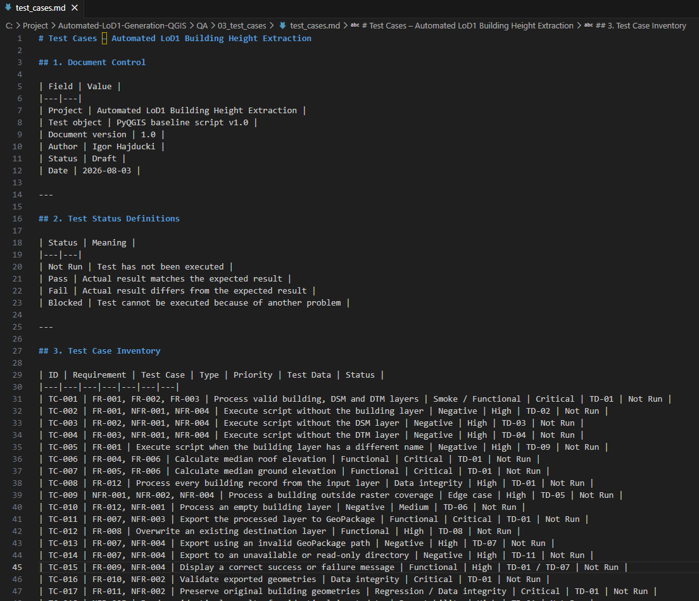

Detailed test execution steps, preconditions, expected results and actual results are documented in:

[`QA/03_test_cases/test_case_details.md`](QA/03_test_cases/test_case_details.md)

Test data preparation is documented in:

[`QA/03_test_cases/test_data_preparation.md`](QA/03_test_cases/test_data_preparation.md)

---

## Example Defect Lifecycle

### TC-001 – Valid Processing Workflow

The first smoke test was executed against baseline build **v1.0**.

### Initial Result

**FAIL**

The script successfully loaded the required input layers and reached the processing stage, but two separate software defects were identified.

---

### Defect KAN-7 – GeoPackage Export Failure

The GeoPackage export stage terminated with:

```text
ValueError: too many values to unpack (expected 2)
```

The baseline implementation incorrectly handled the return values of:

```python
QgsVectorFileWriter.writeAsVectorFormatV3()
```

Evidence from the failed execution:

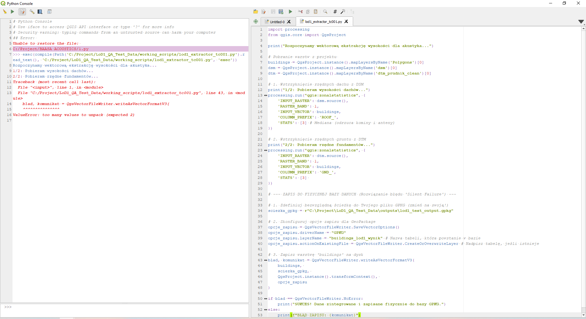

The defect was registered in Jira with:

- **Severity:** Critical
- **Priority:** High

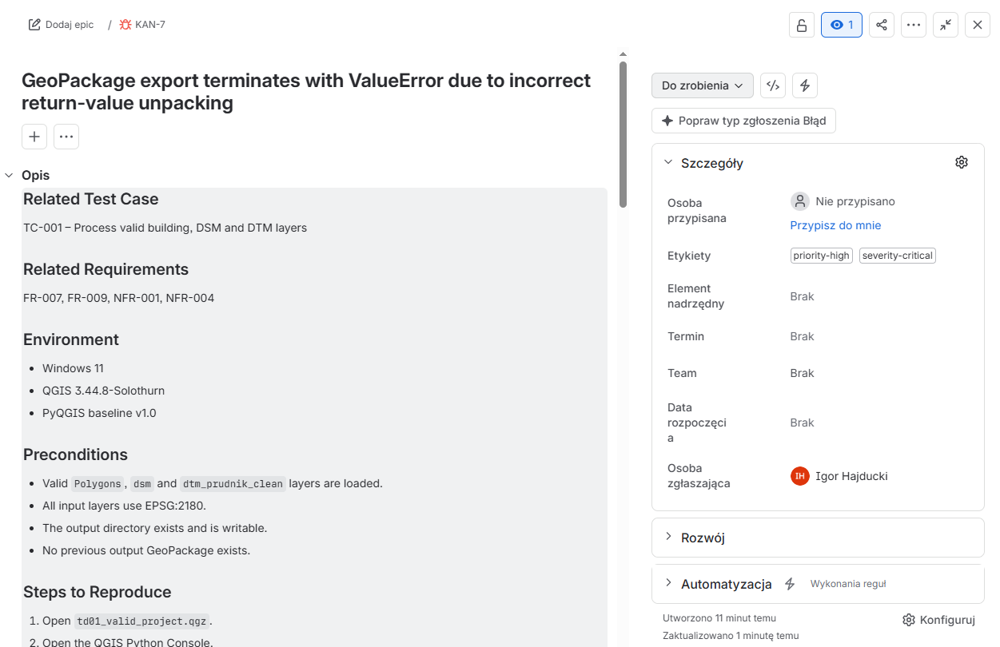

---

### Defect KAN-9 – Incorrect Zonal Statistics

The intended application behaviour was to generate:

- `ROOF_median`
- `GND_median`

Instead, baseline v1.0 generated fields such as:

- `ROOF_count`
- `ROOF_sum`
- `ROOF_mean`
- `GND_count`
- `GND_sum`
- `GND_mean`

This was treated as a separate functional defect.

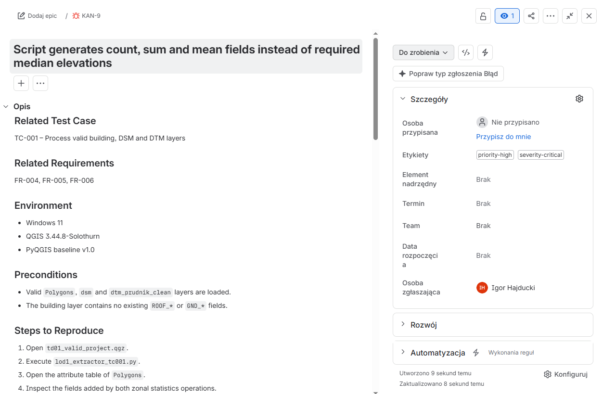

---

## Corrective Build v1.1

Build **v1.1** corrected:

1. GeoPackage export return-value handling.
2. Zonal statistics implementation.

The corrected implementation uses the feature-based zonal statistics algorithm and explicitly requests median values.

The expected output fields became:

- `ROOF_median`
- `GND_median`

Evidence of the implementation change:

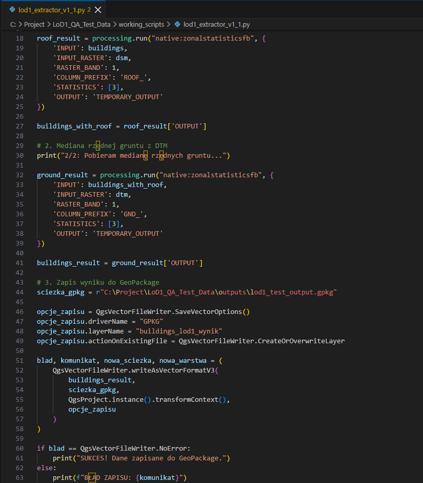

---

## TC-001 Retest

TC-001 was repeated using build **v1.1**.

The script completed successfully and exported the expected GeoPackage.

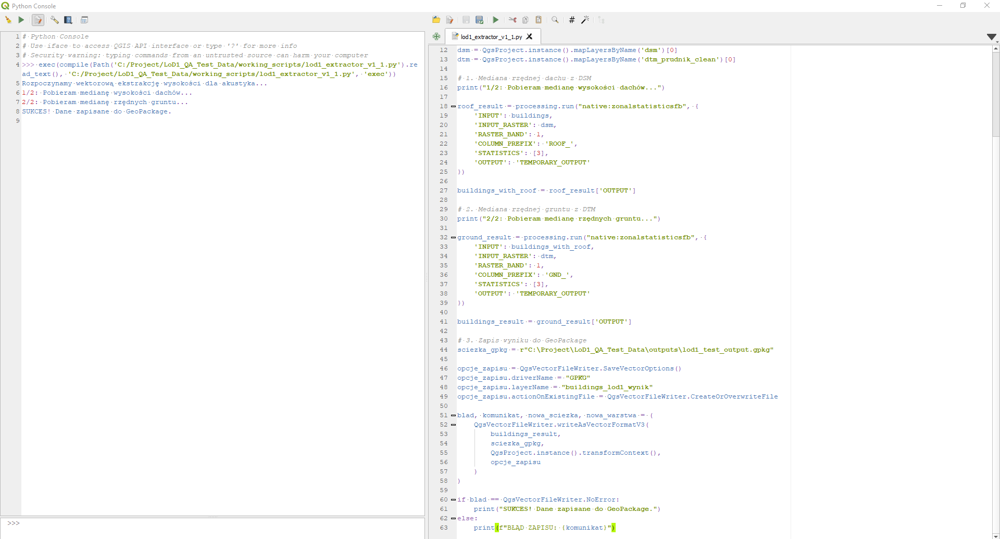

The output contained:

- 2 expected building records,
- `ROOF_median`,
- `GND_median`,
- numeric elevation values,
- no unexpected NULL values for the controlled TD-01 dataset.

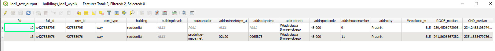

**Retest result: PASS**

KAN-7 and KAN-9 were closed after successful verification.

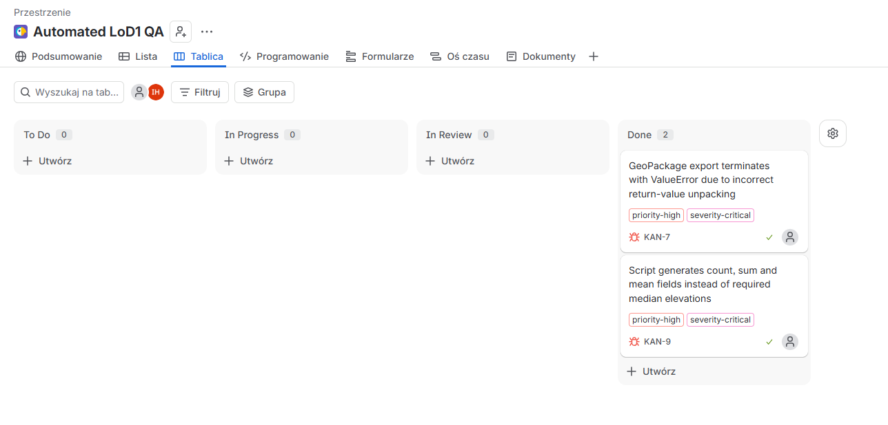

---

## Independent Spatial Validation

The values produced by the corrected application were independently checked using QGIS zonal statistics.

### Ground Median – DTM

Manual validation produced approximately:

| FID | Manual DTM Median |
|---:|---:|
| 10 | 234.2485 m |
| 13 | 235.1835 m |

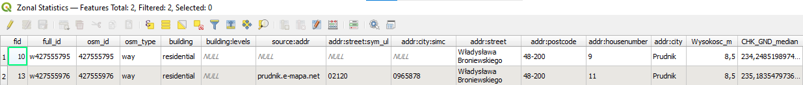

The independently calculated values matched the values generated by the corrected application.

**TC-007 result: PASS**

---

### Roof Median – DSM

Manual validation produced approximately:

| FID | Manual DSM Median |
|---:|---:|
| 10 | 239.4506 m |
| 13 | 241.8607 m |

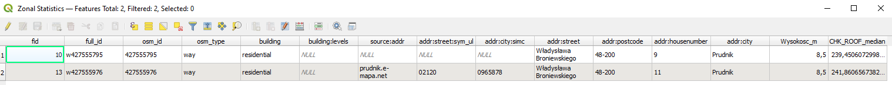

The independently calculated values matched the application output.

**TC-006 result: PASS**

---

## Test Data Investigation

During the initial TC-001 execution, the generated ground statistics contained unexpected `NULL` values.

The behaviour was investigated before being classified as another software defect.

The investigation confirmed that the original TD-01 DTM contained internal NoData areas underneath the selected polygons.

The issue was therefore classified as a **test data problem**, not an additional baseline application defect.

The controlled positive test dataset was corrected by:

- identifying DTM NoData gaps,
- filling the required local NoData areas,
- confirming CRS EPSG:2180,
- selecting buildings fully covered by both DSM and DTM,
- independently checking the resulting raster values.

This investigation is documented in:

[`QA/03_test_cases/test_data_preparation.md`](QA/03_test_cases/test_data_preparation.md)

This step demonstrates an important QA distinction between:

**a software defect**

and

**invalid or unsuitable test data**.

---

## Database Validation – DBeaver / SQL

The generated GeoPackage was opened directly in **DBeaver** as a SQLite database.

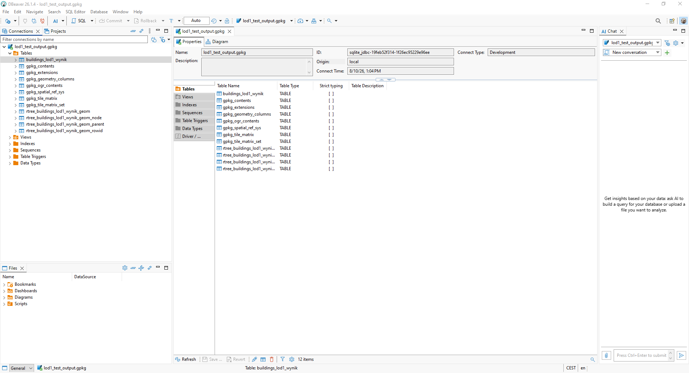

Backend validation covered:

- exported record count,
- NULL validation,
- roof / ground elevation consistency,
- calculated relative building heights,
- GeoPackage metadata registration.

Example SQL query:

```sql
SELECT
    fid,
    ROOF_median,
    GND_median,
    ROUND(ROOF_median - GND_median, 2) AS calculated_height
FROM buildings_lod1_wynik;
```

Example result:

| FID | ROOF_median | GND_median | Calculated height |
|---:|---:|---:|---:|
| 10 | 239.4506 | 234.2485 | 5.20 m |
| 13 | 241.8607 | 235.1835 | 6.68 m |

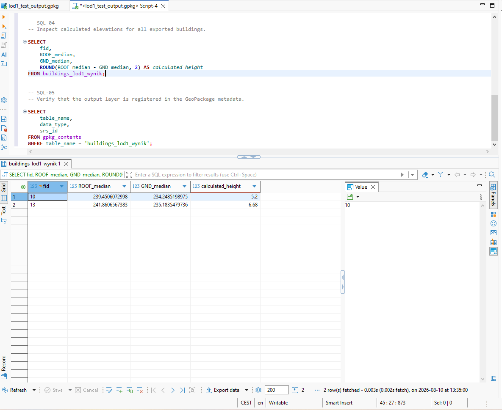

A separate query checked for missing values in the required output fields.

It returned **0 records**.

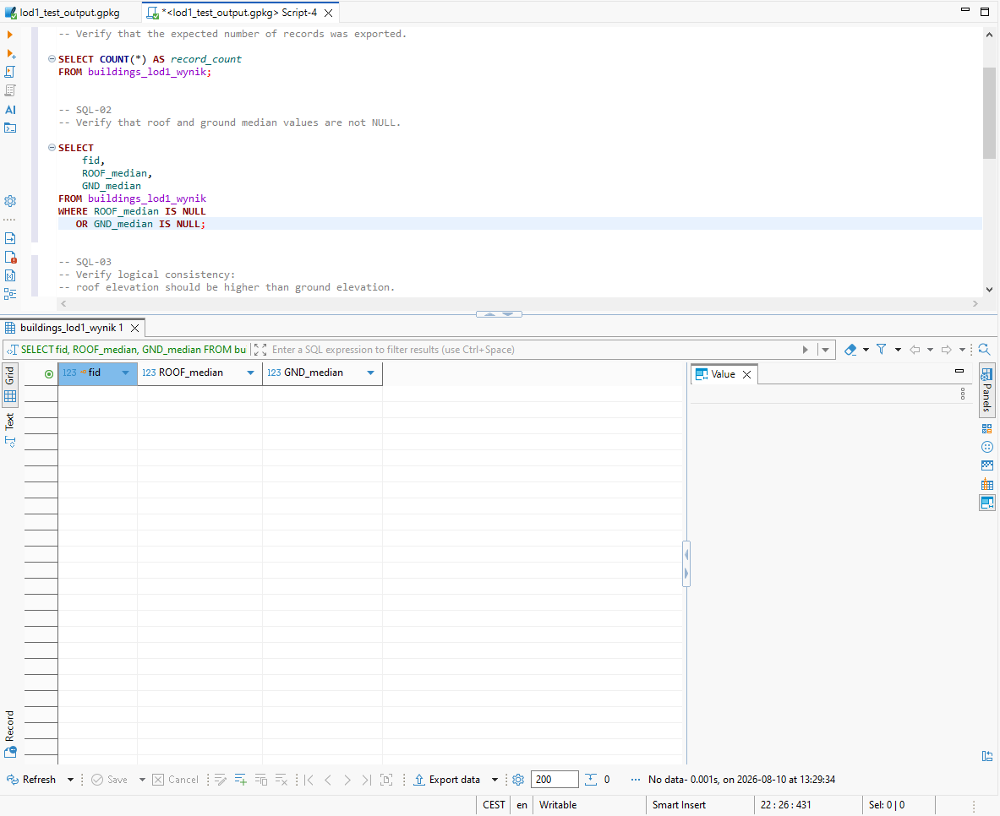

The SQL validation confirmed that:

- the expected number of records was exported,
- both median fields contained numeric values,
- roof elevation was higher than ground elevation,
- calculated building heights were positive.

**TC-020 result: PASS**

The SQL validation script is available here:

[`QA/05_sql_validation/sql_validation.sql`](QA/05_sql_validation/sql_validation.sql)

Results are documented in:

[`QA/05_sql_validation/sql_validation_results.md`](QA/05_sql_validation/sql_validation_results.md)

---

## Negative Testing

### TC-002 – Missing Building Layer

A controlled negative test project was prepared with:

- `dsm`
- `dtm_prudnik_clean`

but without the required:

- `Polygons`

layer.

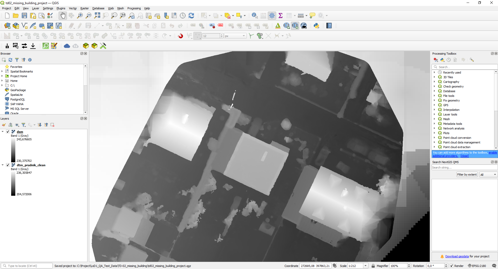

Build **v1.1** terminated with:

```text
IndexError: list index out of range
```

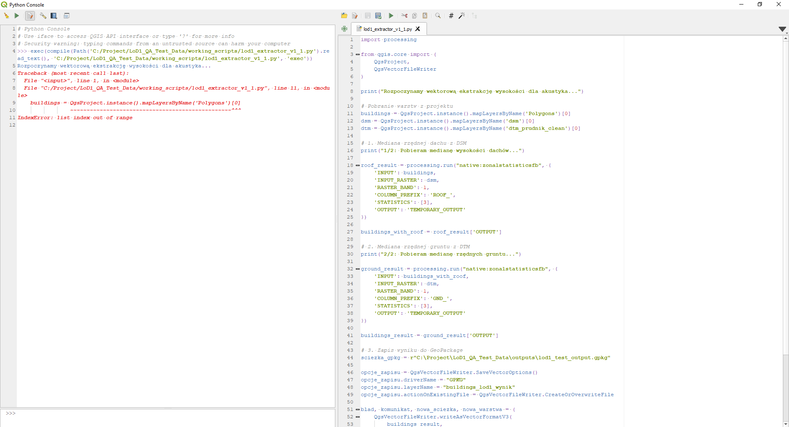

The application did not provide a clear explanation that the required building layer was missing.

The defect was registered as:

**KAN-10 – Script terminates with unhandled IndexError when building layer is missing**

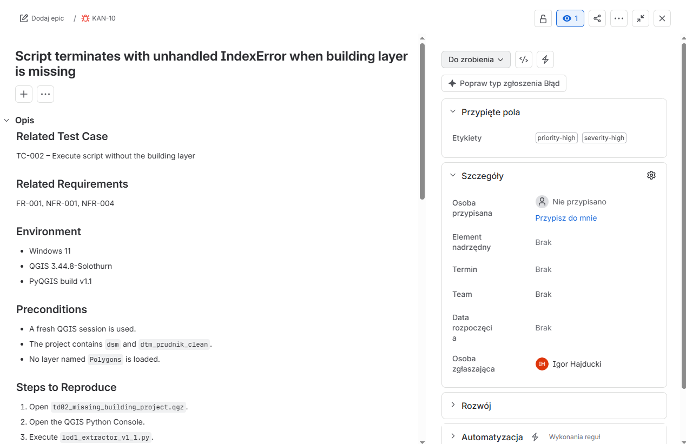

---

## Corrective Build v1.2

Build **v1.2** introduced explicit validation of required input layers.

Example:

```python
building_layers = QgsProject.instance().mapLayersByName("Polygons")

if not building_layers:
    raise RuntimeError(
        "Required building layer 'Polygons' was not found in the current QGIS project."
    )
```

The same validation pattern was introduced for:

- `Polygons`
- `dsm`
- `dtm_prudnik_clean`

Evidence of the change:

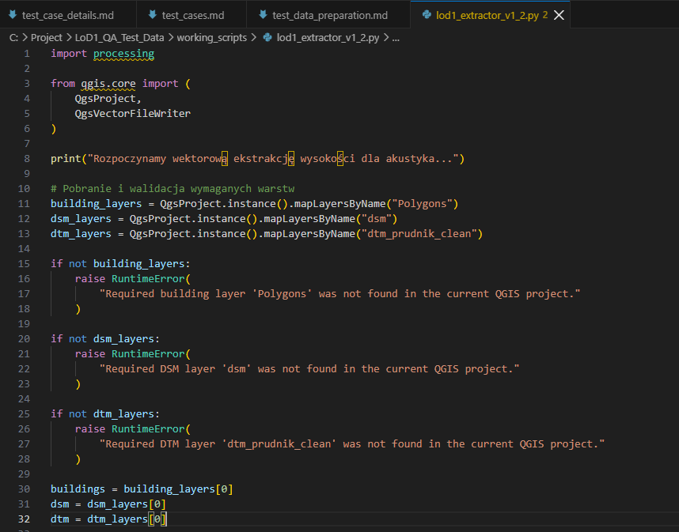

---

## TC-002 Retest

The TD-02 negative dataset was tested again using build **v1.2**.

Instead of the previous unclear `IndexError`, the application returned:

```text
Required building layer 'Polygons' was not found in the current QGIS project.
```

No zonal statistics processing was started and no misleading success message was produced.

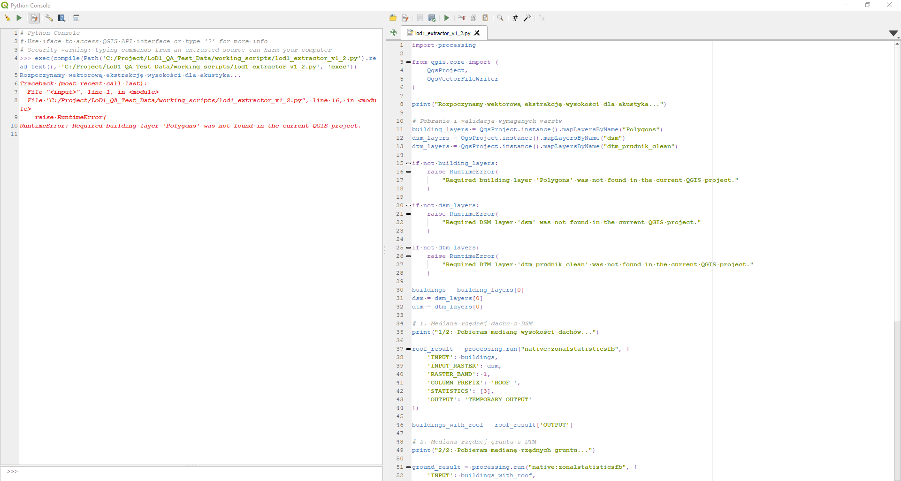

**Retest result: PASS**

KAN-10 was closed after successful verification.


---

## Jira Defect Lifecycle

At the current QA milestone, three confirmed software defects have been documented and successfully retested.

| Jira ID | Defect | Severity | Final Result |
|---|---|---|---|
| KAN-7 | GeoPackage export terminates with ValueError | Critical | Fixed / Retest PASS |
| KAN-9 | Incorrect zonal statistics generated | Critical | Fixed / Retest PASS |
| KAN-10 | Missing building layer causes unhandled IndexError | High | Fixed / Retest PASS |

Application-ready Jira board:

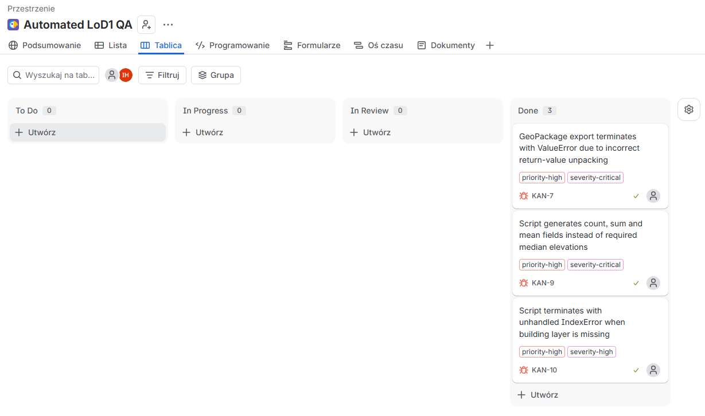

Detailed public bug reports are available in:

[`QA/04_bug_reports`](QA/04_bug_reports)

Including:

- [`BUG-001_geopackage_export.md`](QA/04_bug_reports/BUG-001_geopackage_export.md)
- [`BUG-002_wrong_zonal_statistics.md`](QA/04_bug_reports/BUG-002_wrong_zonal_statistics.md)
- [`BUG-003_missing_building_layer.md`](QA/04_bug_reports/BUG-003_missing_building_layer.md)

---

## Source Code Versions

The repository contains separate application versions used during the QA process.

### Baseline v1.0

[`lod1_extractor_baseline_v1_0.py`](lod1_extractor_baseline_v1_0.py)

This is the preserved baseline version used for the initial software testing process.

### Interim Corrective Build v1.1

Build v1.1 corrected:

- zonal statistics configuration,
- GeoPackage export handling.

It was used to perform the successful TC-001 retest.

### Corrective Build v1.2

[`lod1_extractor_v1_2.py`](lod1_extractor_v1_2.py)

Build v1.2 additionally introduces validation of mandatory input layers.

The original baseline remains preserved so that the defect lifecycle and changes between versions can be reviewed.

---

# Original GIS / UAV Workflow

## Overview

This repository originally contained a Proof of Concept (PoC) PyQGIS script developed to automate the extraction of building heights from UAV-derived elevation models (DTM/DSM) to generate Level of Detail 1 (LoD1) 3D buildings.

The primary business goal is to prepare clean, reproducible spatial data ready for acoustic simulation software (e.g., CadnaA, SoundPLAN).

The workflow focuses on transitioning raw UAV data into analysis-ready spatial data using automated GIS processing.

---

## Tech Stack

- **Point Cloud Processing:** CloudCompare (CSF Algorithm)
- **GIS Environment:** QGIS 3.44.8-Solothurn
- **Automation:** Python / PyQGIS API
- **Raster Data:** DSM / DTM / nDSM
- **Vector Data:** Building polygons
- **Output Format:** GeoPackage
- **Project CRS:** EPSG:2180

---

## Step-by-Step GIS Workflow

### 1. Point Cloud Processing & Rasterization

Before automating the workflow in QGIS, the raw UAV point cloud was filtered using the **Cloth Simulation Filter (CSF)** in CloudCompare to separate ground from non-ground points.

The results were rasterized into:

- a Digital Terrain Model (DTM),
- a Digital Surface Model (DSM).

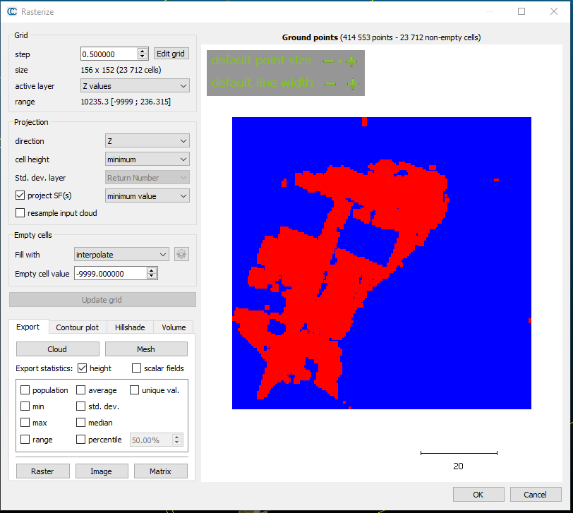

---

### 2. Automated Raster Processing (PyQGIS)

To ensure alignment of the elevation models and calculate the normalized Digital Surface Model (nDSM), a Python script was executed within the QGIS environment.

The workflow:

1. clips the DSM to the DTM extent,
2. aligns the raster datasets,
3. performs raster calculation:

```text
DSM - DTM = nDSM
```

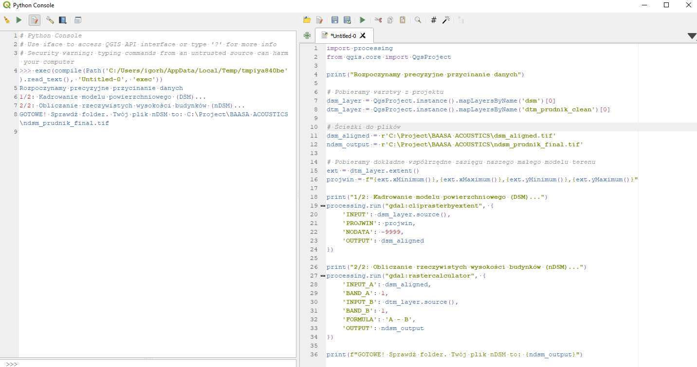

---

### 3. Vector Data Integration

Building footprints were acquired using the QuickOSM plugin by querying standard OpenStreetMap building tags within the project area.

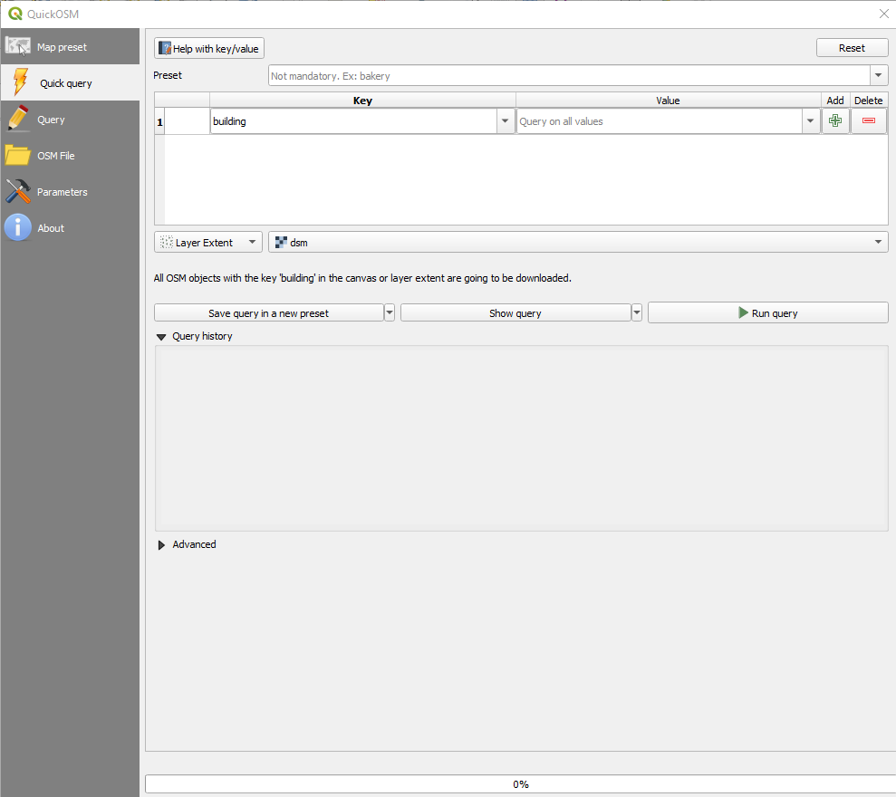

The resulting vector footprints were compared with the DSM coverage.

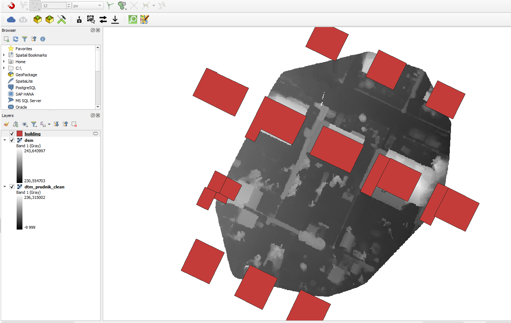

---

### 4. Zonal Statistics Automation (PyQGIS)

Instead of manually extracting elevation values, a custom PyQGIS workflow was created to calculate zonal statistics.

The intended workflow calculates median elevation values for:

- roof elevation from DSM,
- ground elevation from DTM.

Median statistics help reduce the influence of local anomalies such as:

- chimneys,
- antennas,
- isolated elevation artefacts.

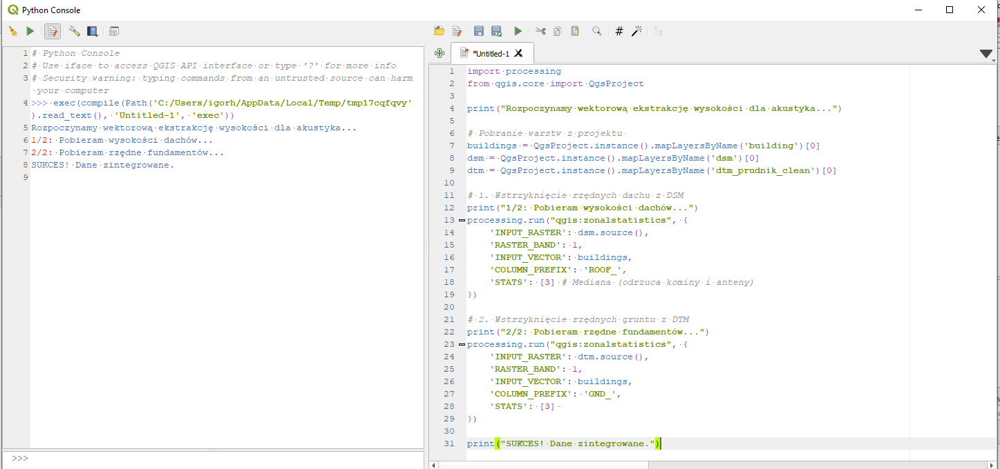

The later QA case study documented in this repository identified defects in the original implementation of this step and verified their correction.

---

### 5. Data Cleaning and Height Calculation

To prepare the final LoD1 data, relative building height is calculated from:

```text
ROOF_median - GND_median
```

During the original GIS workflow, defensive expressions such as `coalesce` were also used during data preparation to reduce downstream problems caused by missing attribute values.

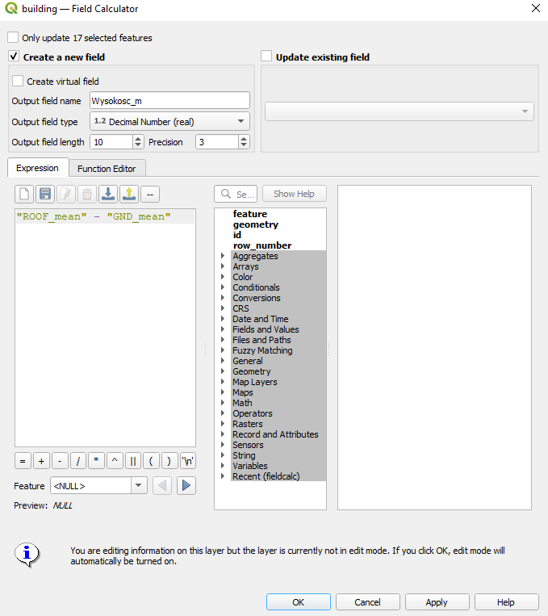

---

## Original Results & Impact

- **Automated Generation:** Multiple LoD1 buildings can be generated over the test area without manual point-clicking.
- **Software Compatibility:** Output is saved as a structured GeoPackage suitable for further GIS processing and preparation for acoustic simulation software.
- **Scalability:** The PyQGIS workflow provides a reproducible basis for processing future acoustic modelling datasets and reducing repetitive manual GIS work.
- **Structured Data:** GeoPackage provides geometry support, structured attributes and compatibility with QGIS / GDAL tools.

---

## QA Impact on the Original GIS Project

Extending the original GIS automation project into a QA case study demonstrated that successful automation alone is not sufficient.

The application was therefore subjected to:

- requirements-based testing,
- controlled test datasets,
- positive scenarios,
- negative scenarios,
- independent spatial validation,
- SQL backend verification,
- defect lifecycle management,
- corrective builds,
- retesting.

This repository therefore demonstrates both:

**GIS / Python automation**

and

**software quality assurance / validation**.

---

## Repository Structure

```text
Automated-LoD1-Generation-QGIS/
│
├── README.md
├── .gitignore
│
├── lod1_extractor_baseline_v1_0.py
├── lod1_extractor_v1_2.py
│
└── QA/
    ├── 01_requirements/
    ├── 02_test_plan/
    ├── 03_test_cases/
    ├── 04_bug_reports/
    ├── 05_sql_validation/
    ├── 06_evidence/
    │   ├── automation/
    │   ├── documentation/
    │   ├── jira/
    │   ├── qgis/
    │   └── sql/
    ├── 07_uml/
    ├── 08_automation/
    └── 09_test_summary/
```

---

## QA Documentation

Key documents:

- [Software Requirements Specification](QA/01_requirements/software_requirements_specification.md)
- [Test Plan](QA/02_test_plan/test_plan.md)
- [Test Case Inventory](QA/03_test_cases/test_cases.md)
- [Detailed Test Cases](QA/03_test_cases/test_case_details.md)
- [Test Data Preparation](QA/03_test_cases/test_data_preparation.md)
- [Bug Reports](QA/04_bug_reports)
- [SQL Validation](QA/05_sql_validation/sql_validation.sql)
- [SQL Validation Results](QA/05_sql_validation/sql_validation_results.md)

---

## Project Status

**Current milestone: Application-ready QA Portfolio**

The test suite contains **21 designed test cases**.

At the current milestone:

- **5 test cases** have been formally executed,
- **3 confirmed software defects** have been identified,
- **all 3 confirmed defects** have been fixed,
- **all 3 defect fixes** have passed retesting,
- independent raster-value validation has been performed in QGIS,
- backend validation has been performed using SQL and DBeaver,
- the remaining test cases are documented for future execution.

The project is intentionally presented as an **application-ready milestone**, not as a fully completed 21-case test campaign.

---

## Author

**Igor Hajducki**

GIS / UAV Data Analysis
Python / PyQGIS Automation
Software QA Portfolio